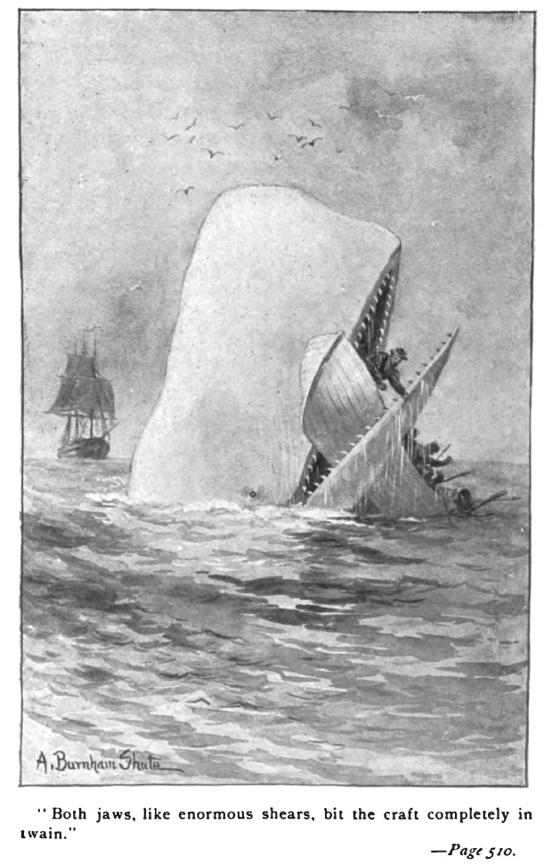

# Analyzing Word Frequencies in Moby Dick Novel


Welcome to my project on exploring the most frequent words in Herman Melville's novel, *Moby Dick*! Using tools for web scraping and text analysis, I extracted, processed, and analyzed the text to uncover interesting insights about word usage. This project demonstrates the use of Python packages like `requests`, `BeautifulSoup`, and `nltk` for natural language processing (NLP).

## View the Notebook
You can check out the full analysis here: [View Notebook](https://github.com/caryhtan/Word-Frequency-in-Classic-Novels/blob/main/notebook.ipynb)

## What I Did
I focused on answering the following key questions:
- What are the most frequent words in *Moby Dick*?
- How often do these words occur?
- How can we visualize word frequency distributions in a novel?

### Data Sources
I used the following dataset:
1. **HTML content of *Moby Dick***  
   This data was fetched from [Project Gutenberg](https://www.gutenberg.org/), a repository of free eBooks. The HTML file contains the full text of *Moby Dick*, along with some additional metadata and formatting.

## What I Found
Here are some key insights I discovered:
- **Most Frequent Words**: Commonly used words like "the," "and," and "of" appear most frequently, which is typical for English text.
- **Word Distribution**: After removing stopwords, words like "whale," "sea," and "man" appear prominently, reflecting the novel's themes.
- **Visualizations**: The word frequency distributions provide a clear picture of the text's focus and style.

## How I Did It
To answer these questions, I:
1. Scraped the *Moby Dick* text using `requests` and `BeautifulSoup`.
2. Processed the raw text to remove non-text content, punctuation, and stopwords.
3. Tokenized the text and calculated word frequencies using `nltk` and `Counter`.
4. Visualized the most common words using Python libraries like `matplotlib`.

### Example Code
Here’s an example of the code I used:
```python
# Fetch HTML content from Project Gutenberg
url = "https://www.gutenberg.org/files/2701/2701-h/2701-h.htm"
response = requests.get(url)
soup = BeautifulSoup(response.text, 'html.parser')

# Extract and clean text
text = soup.get_text()
cleaned_text = ' '.join(text.split())

# Tokenize and count word frequencies
tokens = nltk.word_tokenize(cleaned_text.lower())
word_counts = Counter(tokens)

# Display most common words
print(word_counts.most_common(10))
